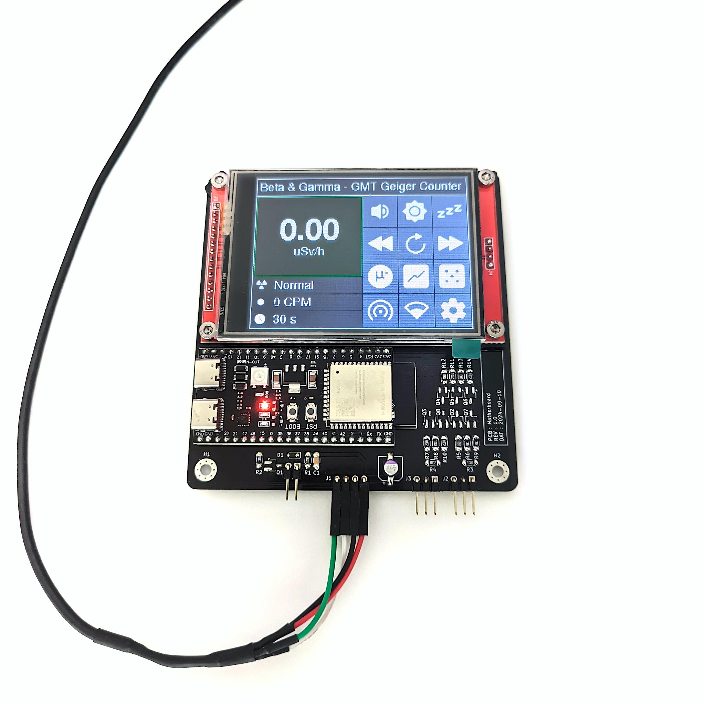

# GMT-Geiger-Counter

## ⚠️ DISCLAIMER

This is a hobby project and should not be relied upon to accurately determine radiation levels, especially not if those radiation levels are potentially dangerous and or lethal!

## 🖼️ Images

    
    
     
    
    

## ⚙️ Features, Settings & Usage

### Geiger counter

#### Main Screen

The main Geiger counter display shows the equivalent dose, a radiation intensity rating, the counts-per-minute reading, and the integration time. From this screen, you can also access and navigate to all other system functions.

    

| ID     | Description                                                                                                                                                                                                                                                                                                                                                        |
| ------ | ------------------------------------------------------------------------------------------------------------------------------------------------------------------------------------------------------------------------------------------------------------------------------------------------------------------------------------------------------------------ |
| **1**  | **Main Equivalent Dose Screen** - Displays the equivalent dose in your selected unit, calculated over the current integration time.                                                                                                                                                                                                                                |
| **2**  | Tap the equivalent dose display to open the Geiger counter information section.                                                                                                                                                                                                                                                                                    |
| **3**  | Shows the current **radiation rating**.                                                                                                                                                                                                                                                                                                                            |
| **4**  | Displays the **counts per minute (CPM)** reading for the current integration time.                                                                                                                                                                                                                                                                                 |
| **5**  | **Integration Time** - The number of seconds the Geiger counter averages measurements to calculate CPM and equivalent dose. Shorter integration times provide more precise readings at high radiation levels; longer times are better for low radiation levels. The counter automatically adjusts this setting but it can also be manually increased or decreased. |
| **6**  | Tap to open the **audio settings**.                                                                                                                                                                                                                                                                                                                                |
| **7**  | Tap to open the **display settings**.                                                                                                                                                                                                                                                                                                                              |
| **8**  | Tap to enter **sleep mode**, which turns off the display and mutes all buzzer sounds.                                                                                                                                                                                                                                                                              |
| **9**  | Tap to manually **decrease** the integration time.                                                                                                                                                                                                                                                                                                                 |
| **10** | Tap to **reset** the integration time to **automatic**.                                                                                                                                                                                                                                                                                                            |
| **11** | Tap to manually **increase** the integration time.                                                                                                                                                                                                                                                                                                                 |
| **12** | Tap to enable and open the **cosmic ray detector**.                                                                                                                                                                                                                                                                                                                |
| **13** | Tap to view **radiation history** in a graphical format.                                                                                                                                                                                                                                                                                                           |
| **14** | Tap to enable and open the **true random number generator**.                                                                                                                                                                                                                                                                                                       |
| **15** | Tap to open the **hotspot settings**.                                                                                                                                                                                                                                                                                                                              |
| **16** | Tap to open the **Wi-Fi settings**.                                                                                                                                                                                                                                                                                                                                |
| **17** | Tap to open the **system settings**.                                                                                                                                                                                                                                                                                                                               |

### Cosmic ray detector

The cosmic ray detector measures cosmic ray exposure by recording coincidence events, which are shown on this screen. While the detector is enabled, its data is also available via the serial console, the wireless API interface and the log file.

    

| ID    | Description                                                                                                                                                                                                                          |
| ----- | ------------------------------------------------------------------------------------------------------------------------------------------------------------------------------------------------------------------------------------ |
| **1** | **Main Coincidence Events Screen** - Shows the total number of coincidence events recorded since the cosmic ray detector was enabled. This value resets when the cosmic ray detector is disabled.                                    |
| **2** | **Coincidence Events per Hour** - Displays the hourly average since the cosmic ray detector was enabled. This value resets when the cosmic ray detector is disabled.                                                                 |
| **3** | **Total Coincidence Events (Since Power-On)** - A sum of all coincidence events recorded since the device was powered on. This value only increases when the cosmic ray detector is enabled, but does not reset when it is disabled. |
| **4** | Tap to **temporarily mute detection sounds**. Tap again to re-enable them. This only mutes regular detection sounds; other alerts will still play.                                                                                   |
| **5** | Tap to enter **sleep mode**, which turns off the display and mutes all buzzer sounds.                                                                                                                                                |
| **6** | **Main Tube Detections** - The total number of detections by the main tube since the cosmic ray detector was enabled. This value resets when the cosmic ray detector is disabled.                                                    |
| **7** | **Follower Tube Detections** - The total number of detections by the follower tube since the cosmic ray detector was enabled. This value resets when the cosmic ray detector is disabled.                                            |
| **8** | Tap to **exit the cosmic ray detector** and return to the Geiger counter screen. A prompt will ask whether to disable the detector or keep it running in the background.                                                             |

### True random number generator

The true random number generator produces truly random numbers. You can set a custom range from 1 to 99, then roll to generate a number, which appears on the main result screen. While the generator is enabled, the Geiger counter is disabled. During this time, a continuous stream of random bits is also available via the serial console and wireless API interface.

    

| ID     | Description                                                                                                                                        |
| ------ | -------------------------------------------------------------------------------------------------------------------------------------------------- |
| **1**  | **Main Result Screen** - Displays a true random number once the roll is complete.                                                                  |
| **2**  | Tap to **increase the minimum value** of the result range.                                                                                         |
| **3**  | Tap to **increase the maximum value** of the result range.                                                                                         |
| **4**  | Shows the **minimum value** in the result range.                                                                                                   |
| **5**  | Shows the **maximum value** in the result range.                                                                                                   |
| **6**  | Tap to **decrease the minimum value** of the result range.                                                                                         |
| **7**  | Tap to **decrease the maximum value** of the result range.                                                                                         |
| **8**  | Tap to **roll a random number**.                                                                                                                   |
| **9**  | Tap to **temporarily mute detection sounds**. Tap again to re-enable them. This only mutes regular detection sounds; other alerts will still play. |
| **10** | Tap to enter **sleep mode**, which turns off the display and mutes all buzzer sounds.                                                              |
| **11** | Tap to **disable the true random number generator** and return to the Geiger counter screen.                                                       |

## 🧩 Tube Compatibility

The tube driver PCB is compatible with a variety of Geiger-Müller tubes. Any tube that has a total length including the contacts of **110mm** to **107mm** or **90mm** to **87mm** and operates around **400V DC** should be physically compatible. Here are some tubes that will be compatible with this Geiger counter:

| Tube       | Compatible | Tested | Note                                          |
| ---------- | ---------- | ------ | --------------------------------------------- |
| SBM-20     | ✅          | ✅      | The tube this Geiger counter was designed for |
| STS-5      | ✅          | ❌      | The predecessor tube to the SBM-20            |
| J305 107mm | ✅          | ❌      | A modern alternative to the SBM-20            |
| J305 90mm  | ✅          | ❌      | A shorter version of the J305 107mm           |
| M4011      | ✅          | ❌      | An alternative to the J305 90mm               |
